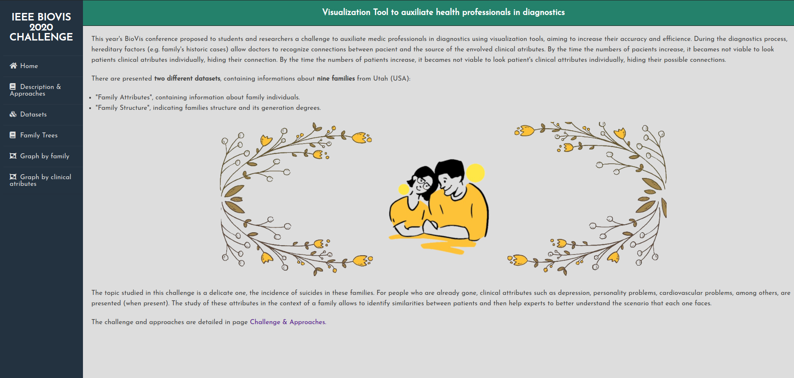
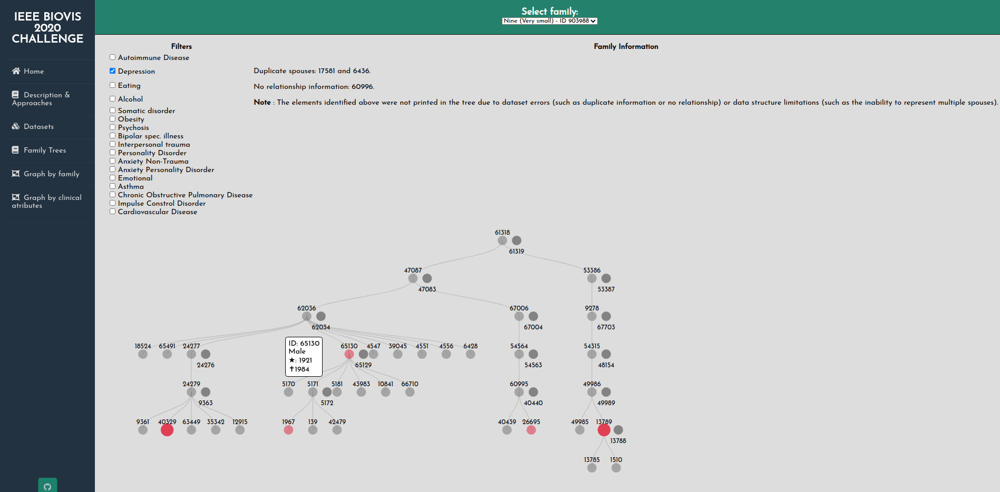
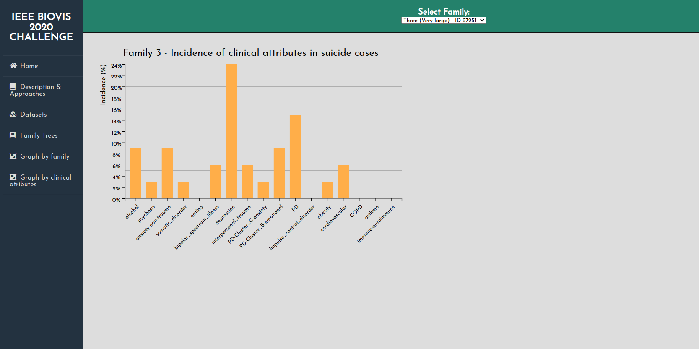

# IEEE BioVis 2020: Data Visualization Challenge :mag_right::bar_chart:

This challenge was proposed by the IEEE BioVis 2020 conference, in which the main objective was creating **a visualization tool to help health professionals** to analyse data sets of families with high incidence levels of suicide cases (from Utah - USA). 

In this project were proposed two approaches on a visualization tool: interactive family trees and bar graphs, and they were developed using the **D3.js framework**.

## Website Overview :mag_right::link:

To present the tools developed in this project, a website was created showing the following steps: problem description, approaches presentation, available datasets and the tools themselves:

[**Visualization Tool Website**](https://geflx.github.io/ieee-biovis2020-datavis-challenge)

## Interactive Family Trees :family:

Family trees are very useful for **visualizing the general structure** of a family and also **explore its members individually**. Families when analyzed only in general context can hide important information to assist professionals in medical diagnostics. Thus, family trees proved to be an excellent approach to the problem:

## Bar Graphs (Clinical Atribute/Family) :bar_chart:

Bar charts are highly recommended when you need to **compare data**, from them our brain can have a **better perception** of the differences between the data presented. Bar charts were generated to analyze the distribution of each clinical attribute among families, and also the distribution of all attributes in the same family:

## Authors :octocat:

* Gabriel Félix
* [Natan Garcias](https://github.com/NatanGarcias) 

## Results :closed_book:

This project obtained the **best score** in the postgraduate subject INF 723 - Data Visualization at the Federal University of Viçosa (UFV). The chosen approaches generated a very intuitive and effective tool for presenting the available datasets. 

The authors believe that it was an excellent opportunity to **practice the theories** taught in the subject and to learn a new JavaScript framework (**D3.js**).